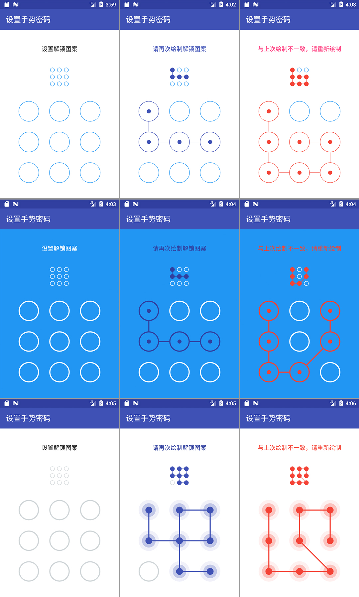

###  Pattern Locker

此为Android App中常用控件之一的图案解锁（手势解锁）控件开源库，PatternLockerView为图案解锁主控件，主要负责图案密码的绘制，
PatternIndicatorView为指示器控件，为PatternLockerView的辅助控件，可选择使用，具体使用方法请参考app module中代码。

### 效果图


### 使用方法
[](https://jitpack.io/#ihsg/PatternLocker)

Step1: 首先打开项目更目录下的 build.gradle，添加：
````
allprojects {
 repositories {
    jcenter()
    maven { url "https://jitpack.io" }
 }
}
````

Step2：打开想依赖这个 library 的模块，比如这里我们是 app 这个 module，添加：
````
dependencies {
	compile 'com.github.ihsg:PatternLock:1.0.0'
}
````

Step3: 在手势密码设置页添加PatternLockViewer和PatternIndicatorView（如果需要的化话）自定义控件，
并根据UI设计设置属性，例如此处使用demo中activity_pattern_setting.xml 文件为例：
````
<?xml version="1.0" encoding="utf-8"?>
<LinearLayout xmlns:android="http://schemas.android.com/apk/res/android"
    xmlns:app="http://schemas.android.com/apk/res-auto"
    android:layout_width="match_parent"
    android:layout_height="match_parent"
    android:background="@color/color_blue"
    android:orientation="vertical">

    <android.support.v7.widget.Toolbar
        style="@style/AppTheme.Toolbar"
        app:title="@string/title_pattern_setting" />

    <com.github.ihsg.patternlocker.PatternIndicatorView
        android:id="@+id/pattern_indicator_view"
        android:layout_width="50dp"
        android:layout_height="50dp"
        android:layout_gravity="center"
        android:layout_marginTop="16dp"
        app:piv_color="@color/colorWhite"
        app:piv_errorColor="@color/color_red"
        app:piv_hitColor="@color/colorPrimary" />

    <TextView
        android:id="@+id/text_msg"
        android:layout_width="match_parent"
        android:layout_height="wrap_content"
        android:gravity="center"
        android:padding="16dp"
        android:text="msg"
        android:textColor="@color/colorWhite"
        android:textSize="16dp" />

    <com.github.ihsg.patternlocker.PatternLockerView
        android:id="@+id/pattern_lock_view"
        android:layout_width="match_parent"
        android:layout_height="match_parent"
        android:layout_marginLeft="50dp"
        android:layout_marginRight="50dp"
        app:plv_color="@color/colorWhite"
        app:plv_errorColor="@color/color_red"
        app:plv_fillColor="@color/color_blue"
        app:plv_hitColor="@color/colorPrimary"
        app:plv_lineWidth="2dp" />
</LinearLayout>

````
在java代码中为PatternLockerView添加OnPatternChangeListener并处理相应业务逻辑，例如：
````
package com.github.ihsg.demo;

import android.content.Context;
import android.content.Intent;
import android.os.Bundle;
import android.support.v7.app.AppCompatActivity;
import android.widget.TextView;

import com.github.ihsg.patternlocker.OnPatternChangeListener;
import com.github.ihsg.patternlocker.PatternIndicatorView;
import com.github.ihsg.patternlocker.PatternLockerView;
import com.github.ihsg.patternlocker.ResultState;

import java.util.List;

public class PatternSettingActivity extends AppCompatActivity {

    private PatternLockerView patternLockerView;
    private PatternIndicatorView patternIndicatorView;
    private TextView textMsg;
    private PatternHelper patternHelper;

    public static void startAction(Context context) {
        Intent intent = new Intent(context, PatternSettingActivity.class);
        context.startActivity(intent);
    }

    @Override
    protected void onCreate(Bundle savedInstanceState) {
        super.onCreate(savedInstanceState);
        setContentView(R.layout.activity_pattern_setting);

        this.patternIndicatorView = (PatternIndicatorView) findViewById(R.id.pattern_indicator_view);
        this.patternLockerView = (PatternLockerView) findViewById(R.id.pattern_lock_view);
        this.textMsg = (TextView) findViewById(R.id.text_msg);

        this.patternLockerView.setOnPatternChangedListener(new OnPatternChangeListener() {
            @Override
            public void onStart(PatternLockerView view) {
                patternIndicatorView.updateState(null, ResultState.OK);
            }

            @Override
            public void onChange(PatternLockerView view, List<Integer> hitList) {
                patternIndicatorView.updateState(hitList, ResultState.OK);
            }

            @Override
            public void onComplete(PatternLockerView view, List<Integer> hitList) {
                ResultState resultState = isPatternOk(hitList) ? ResultState.OK : ResultState.ERROR;
                view.setResultState(resultState);
                patternIndicatorView.updateState(hitList, resultState);
                updateMsg();
            }

            @Override
            public void onClear(PatternLockerView view) {
//                patternIndicatorView.updateState(null, ResultState.OK);
                finishIfNeeded();
            }
        });

        this.textMsg.setText("设置解锁图案");
        this.patternHelper = new PatternHelper();
    }

    private boolean isPatternOk(List<Integer> hitList) {
        this.patternHelper.validateForSetting(hitList);
        return this.patternHelper.isOk();
    }

    private void updateMsg() {
        this.textMsg.setText(this.patternHelper.getMessage());
        this.textMsg.setTextColor(this.patternHelper.isOk() ?
                getResources().getColor(R.color.colorPrimary) :
                getResources().getColor(R.color.colorAccent));
    }

    private void finishIfNeeded() {
        if (this.patternHelper.isFinish()) {
            finish();
        }
    }
}
````

Step4: 在手势密码验证页添加添加PatternLockerView和PatternIndicatorView（如果需要的化话）自定义控件，并处理相应业务逻辑。

### 自定义属性说明
- PatternLockerView属性

属性名 | 说明 | 默认值
:----------- | :----------- | :-----------
plv_color         | 默认图案的颜色        | #2196F3
plv_hitColor      | 绘制图案的颜色        | #3F51B5
plv_errorColor    | 绘制图案出错时的颜色   | #F44336
plv_fillColor     | 图案填充色           | #FAFAFA
plv_lineWidth     | 连接线线宽           | 1dp

- PatternIndicatorView属性

属性名 | 说明 | 默认值
:----------- | :----------- | :-----------
piv_color         | 指示器默认图案的颜色        | #2196F3
piv_hitColor      | 指示器中选中图案的颜色        | #3F51B5
piv_errorColor    | 指示器中选中图案出错时的颜色   | #F44336
piv_lineWidth     | 指示器连接线线宽             | 1dp

> 以上各属性均提供共有方法进行设置和获取。